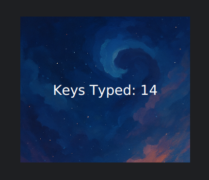

# key-counter
A simple JavaFX desktop application that tracks and counts the number of keys typed. Perfect for developers, writers, or anyone curious about their keyboard usage.

### Simple UI 

### Execute it locally

- Remember to download the JavaFX
- Add the VM options in the IDE

